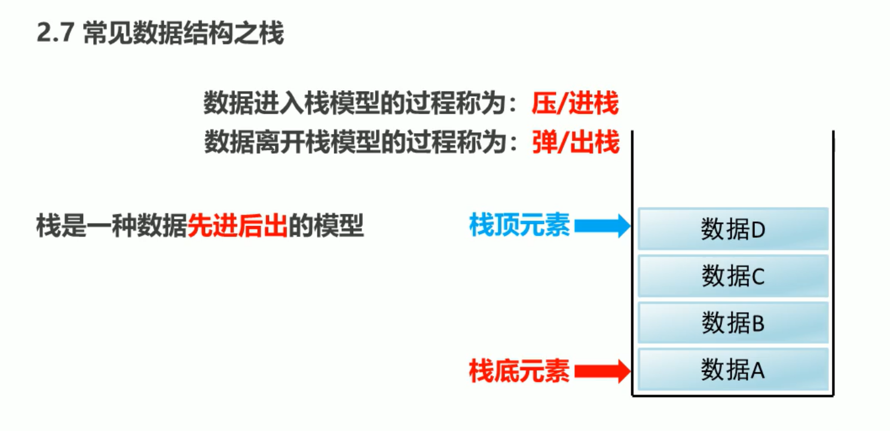
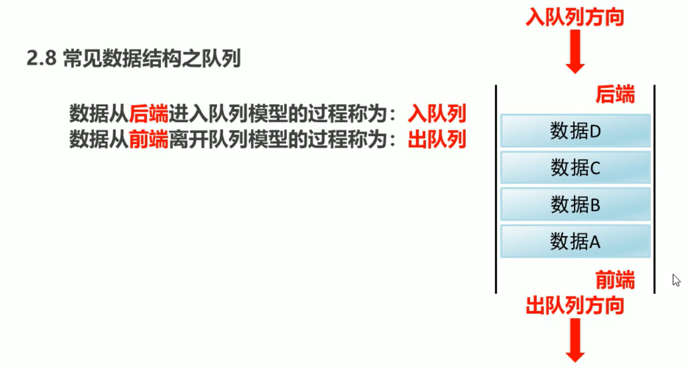
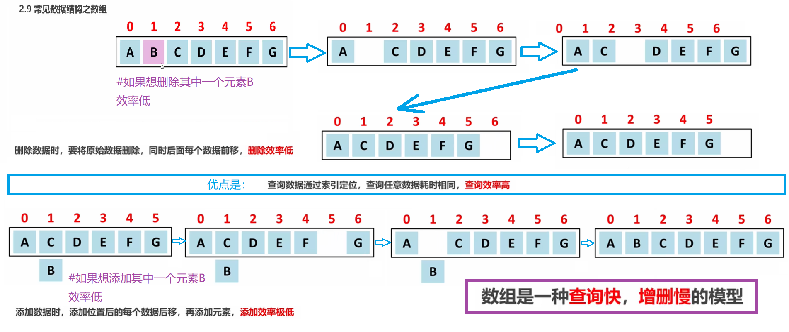
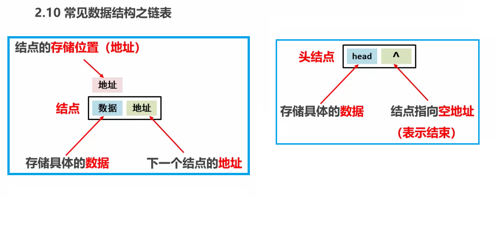
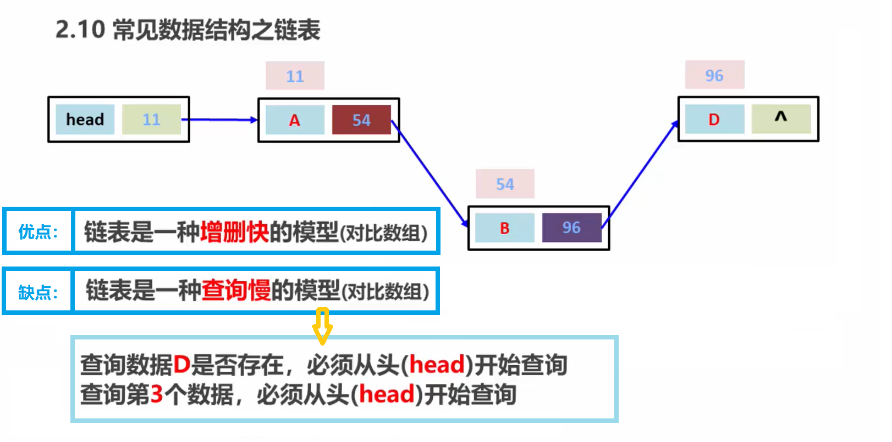
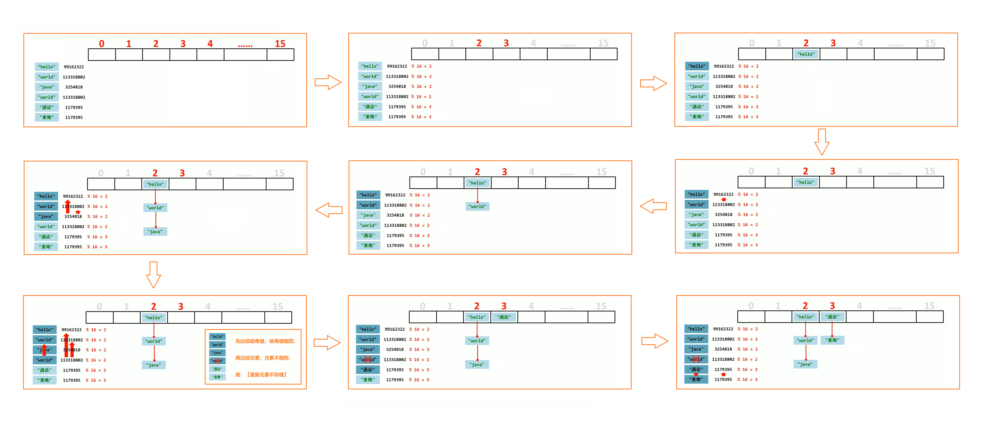

# 常见的数据结构:

----
## 数据结构之【栈】
>  
> 在内存进出两个过程:
> ### [先进后出的模型]
> 数据进入栈模型的过程为: **`【压/进 栈】`**              
> 数据离开栈模型的过程为: **`【弹/出 栈】`**
> 
> ------
> 在进栈的时候，数据先进入栈的底部，`栈底元素――>栈顶元素`     
> 在出栈的时候，数据先从栈最上部出，`栈顶元素――>栈底元素`

## 数据结构之【队列】
> 
> 队列与栈恰好相反:  
> ### [先进先出的模型]
> 数据从后端进入队列模型的过程称为: **`【入队列】`**        
> 数据从后端离开队列模型的过程称为: **`【出队列】`**
> 
> ------
> 进队列与栈相同   
> 出队列的时候是，`前端`(下部)先出

----
----

## 数据结构之【数组】
> 
> ### 优点
> 查询数据通过索引定位,查询任意数据耗时相同,`查询效率高`
> 
> ----
> ### 缺点
> 删除数据时,要将原始数据删除,同时后面�案鍪�据前移,`删除效率低`   
> 添加数据时,添加位置后的每个数据后移,再添加元素,`添加效率极低`
> ### 由此可见 数组是一种查询快,增删慢的模型

## 数据结构之【链表】
> 
> 
> ### 优点
> 链表是一种`增删快`的模型(对比数组)
> ### 缺点
> 链表是一种`查询慢`的模型(对比数组)

## 数据类型之【哈希表】
> JDK8之前,底层采用 [数组] + [链表] 实现,可以说是一个元素为链表的数组。 
> JDK8以后,在长度比较长的时候,底层实现了优化。
> 